# Deploy an App on IBM Cloud

Overview
========

In this lab, you will create your first IBM Cloud application by using a boilerplate from the catalog.

Prerequisites
-------------

You will need the following:

-   Internet Explorer, Safari, Firefox, or Chrome web browser
-   An IBM Cloud account [register here](https://console.bluemix.net/registration)


Section 1. Create an application on IBM Cloud
===========================================

In this lab section, you'll create an application using a Boilerplate from the IBM Cloud catalog.

1.  Log in to IBM Cloud by accessing the url:

    -   https://console.bluemix.net

2.  Click **Log In** and then enter your login information on the IBM id page and click **Sign in**. You should see your dashboard view:

    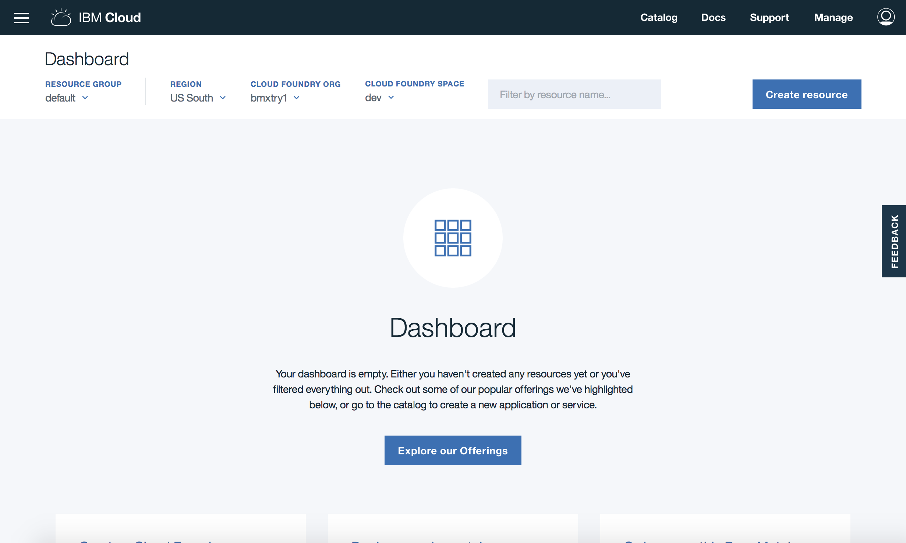

3.  Click **Catalog**.

    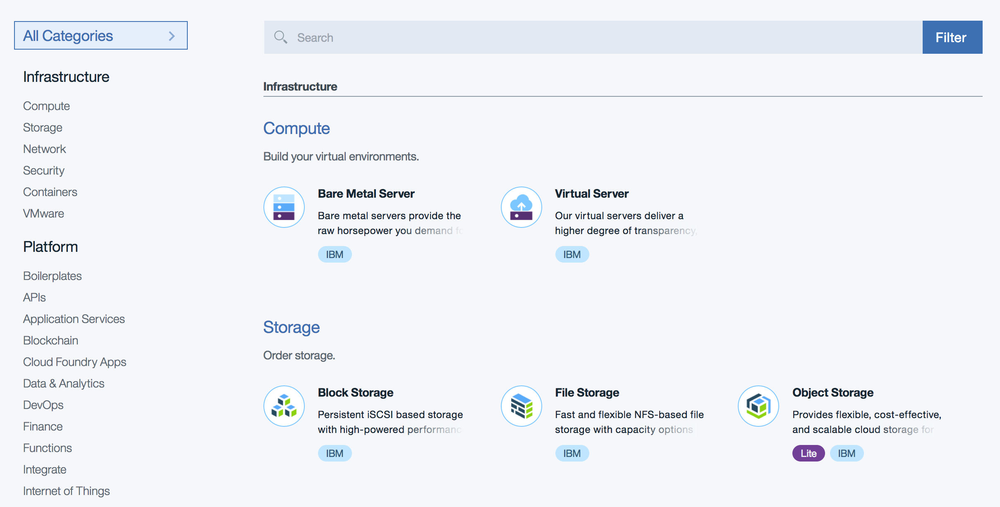

4.  Click **Boilerplates &gt; Node.js Cloudant DB Web Starter**.

    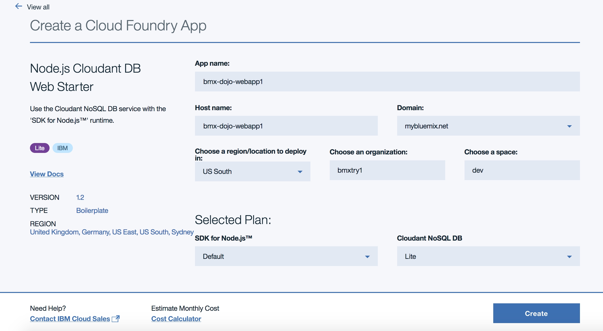

5.  Enter a name for your application. The host name information is automatically entered based on the application name. The host name must be unique on IBM Cloud, so enter a name customized with your initials and the date to make the name unique. Keep the remaining defaults including suggested deployment region.

6.  Click **Create**. The application dashboard will open and a status message will appear while the application is starting.

    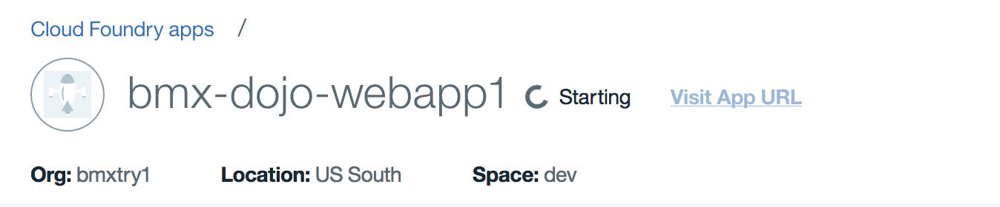

    After a short while, your application will start running and the application dashboard will update with the Running status.

    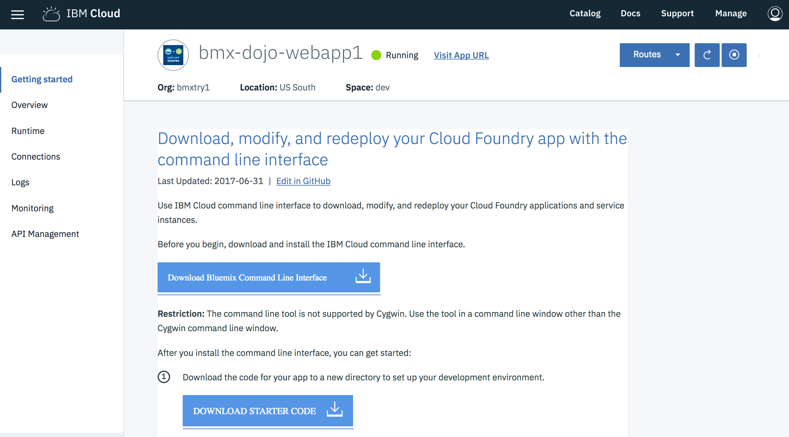

    Click on the url link next to the status to open the application in a new tab. This is a simple application that allows you to store documents. Each document is saved as an object to a Cloudant NoSQL database. Experiment with the application by creating a new category with the **ADD** button or by uploading a test data file or a picture from your workstation.

Summary
-------

You've now added an application to IBM Cloud. In the following sections, you will learn about the structure and management of Cloud Foundry applications in IBM Cloud.

Section 2. Understand the structure of an IBM Cloud Foundry application
============================================================

In this section, you will learn about structure and deployment of a typical Cloud Foundry application by looking at the app code.

1.  In the previous section, you created an application from an IBM Cloud boilerplate. A boilerplate combines a specific runtime environment (node.js for the app you deployed) with some code and one or more services (Cloudant NoSQLDB for the app you deployed) to create an application. Access the github repository which provides the source code for the application at: (https://github.com/IBM-Cloud/nodejs-cloudant)

2.  Get a copy of the code using one of these two methods:    

    *   If you have git installed:

        ```
        git clone https://github.com/IBM-Cloud/nodejs-cloudant.github
        ```

    *   Use the **Download ZIP** option from the **Clone or download** pulldown.

3.  Expand the zip file into a new folder, or just change into the folder created by the `git clone` and examine the contents:

    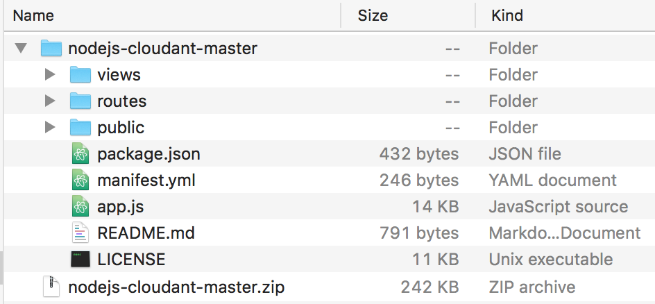

4.  IBM Cloud Foundry applications will almost always have a manifest.yml file. This file specifies how to deploy the application and includes the name for the application and optional settings to specify the amount of memory, number of instances, and services that should be bound to the application on deployment. You may open the manifest.yml file in any convenient text editor you prefer.

    ```
    ---
    declared-services:
      sample-nodejs-cloudant-cloudantNoSQLDB:
        label: cloudantNoSQLDB
        plan: Lite
    applications:
    - name: sample-nodejs-cloudant
      random-route: true
      memory: 256M
      services:
      - sample-nodejs-cloudant-cloudantNoSQLDB

    ```

    This manifest file begins with an extension `declared-services` that is used by the IBM Cloud Continuous Delivery toolchain which is ignored by the Cloud Foundry CLI. We'll ignore this for now. The `applications` section shows typical app metadata. A `name` for the application is always needed. The `random-route` option causes a string to be appended to the application name to form a unique host name. The manifest can specify any needed `services` which are resolved within the Cloud Foundry space for the application. Changing values in the manifest and deploying applications will be covered in a separate lab activity.

4.  Looking at the application directory contents, you will see a javascript source file, app.js and also a dependency file, package.json . When a Cloud Foundry application is deployed to IBM Cloud, the staging environment inspects the files in the application and tries to match the application to a buildpack. A buildpack in Cloud Foundry has a collection of scripts that prepares the application to run on IBM Cloud. The presence of the package.json file will be used to select a node.js buildpack for the application

5.  Examine the public and views folders. These folders contain the images, css, javascript, and html used to provide the web interface for this simple application.

Summary
-------

Each IBM Cloud Foundry application combines code, any other assets needed for the application and a dependency file to specify external components or features needed to support the application. When an application is deployed, it is first built into a static object by the buildpack by combining the application assets with a runtime (e.g. Node.js engine) and all project dependencies. After the application is built, it is then copied to containers to run the specified number of instances from the manifest file.

Section 3. Managing an application using the IBM Cloud console
============================================================

1.  In the left-hand navigation for your application dashboard, select the **Overview** item to bring up a summary for the application.

    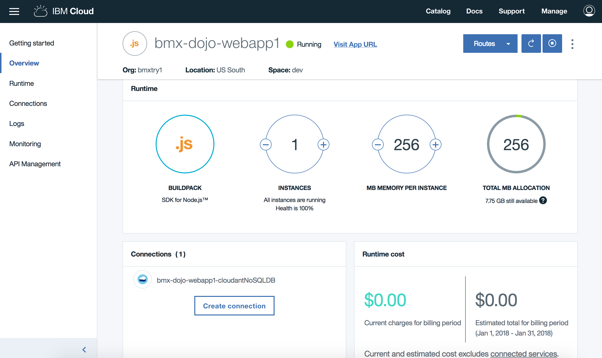

    The **Overview** panel shows the status of the application, the number of active application instances, amount of memory per instance, any connected services and the estimated cost associated with the application.

    The dial on the right side shows how much of your total IBM Cloud Foundry quota is configured to be used by this application. Actual use is less, which is shown on the **Runtime** panel.

    In the upper right of the panel, click on the **Routes** button and choose **Edit Routes**.

    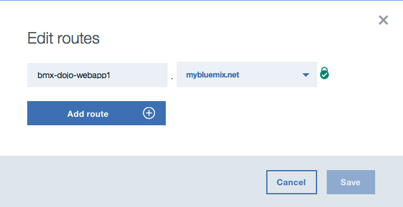

    You can add an additional hostname for your application, if you do, wait a moment for the app to restart and then select the link added to the **Routes** button. This can also be used to make the application available in a custom domain. IBM Cloud provides full support for external domains and adding your own SSL certificates for external domains.

    In the Overview pane, you can scroll down to see a stream of high-level events for the application in the activity feed and optionally configure continuous delivery to automate builds and deployments for the application.

2.  You can understand more specifics about the application through the **Runtime** panel. Select this from the left-hand menu.

    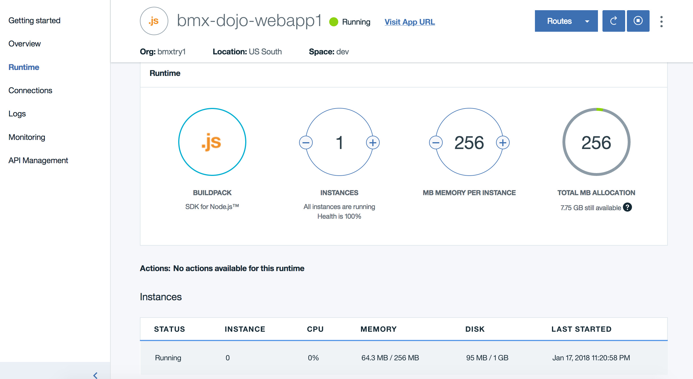

    The instances list will show the CPU, memory and disk usage for each instance that is running for the application.

    Notice how the memory footprint is much less than the allocation of 256 MB? You can adjust the memory set for the application from the web console. Click on the **–** button on the **MB memory per instance dial** to reduce the allocation to 128 MB and then click on **Save**. Accept any warning prompts, and the application will be restarted with the lower memory allocation.

    To make this a permanent change, the manifest.yml file should be updated and the application repushed to IBM Cloud.

    While the application is restarting, select the **Environment variables** tab. From here, you can see the credentials for all services that are bound to the application.

    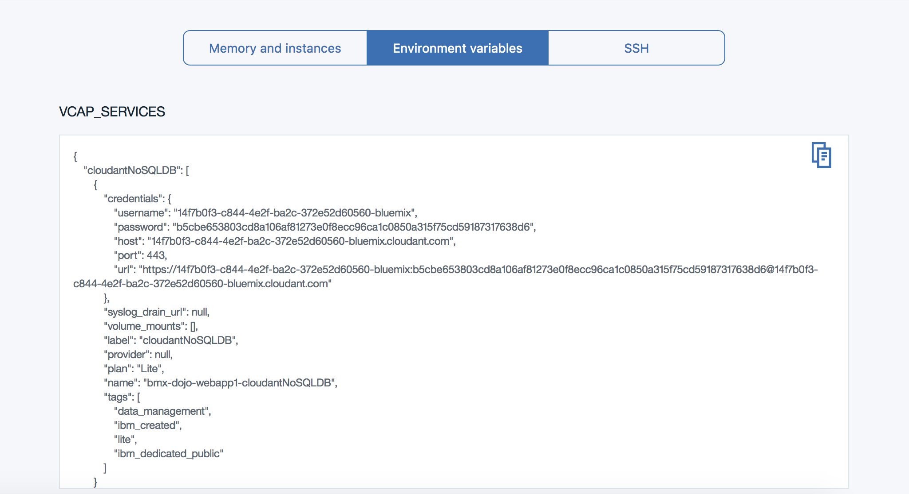

    An IBM Cloud Foundry application will read the `VCAP_SERVICES` environment variable to find credentials for any services that it uses. By getting this configuration from the environment, it's easy to have a single code base work in multiple deployment stages or locations.

3.  Applications in IBM Cloud Foundry write logging and event information to stdout/stderr. You can see application logs and also logs from the IBM Cloud Foundry environment for the applications through the **Logs** panel. Click on **Logs** from the left-hand navigation.

    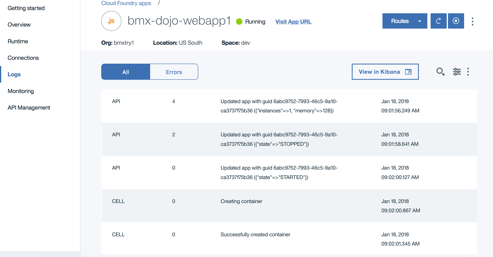

    The **Filter** selector lets you filter out messages from the application as well as parts of the IBM Cloud Foundry environment. Each log entry starts with a code for the source component for the log entry and also the instance number (with 0 for the first instance, 1 for the second and so on).

    Select RTR as the log type:

    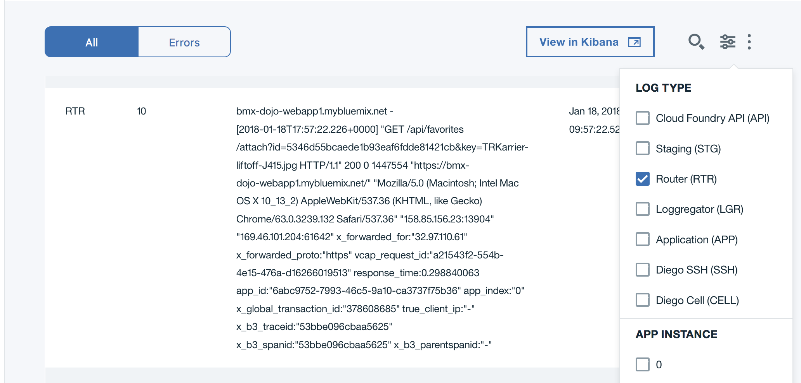

    These entries show the incoming web requests to the application arriving at the IBM Cloud Foundry perimeter. The host, url, and client information including source IP address of the request are recorded.

    Select APP as the log type:

    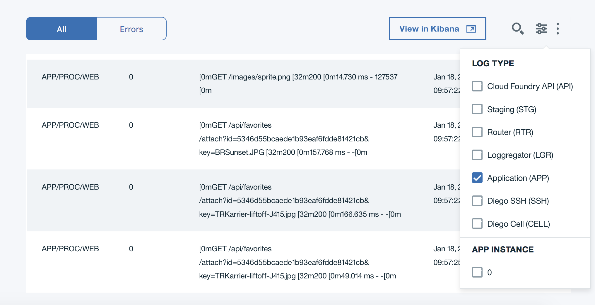

    All stdout/stderr messages from the application are shown. The screenshot example includes some output from the runtime as the application starts and console logs from the application. Your log may have a lot more, especially if you uploaded some files.

    Other common log types you can explore:

    | Type |  Information recorded in log entries |
    |------|--------------------------------------|
    | API  |  Cloud Foundry API calls, such as changes to state like start and stop |
    | STG  |  Messages logged during the application staging (build) process |
    | CELL |  Actions for the container that runs the application |

4.  IBM Cloud provides an ELK (elasticsearch, logstash, kibana) stack for log management. The **View in Kibana** button launches a Kibana dashboard where you can filter log data based on time ranges, filter on fields from the log data, and examine specific log entries

    Click on **View in Kibana** to open the dashboard for your application.

    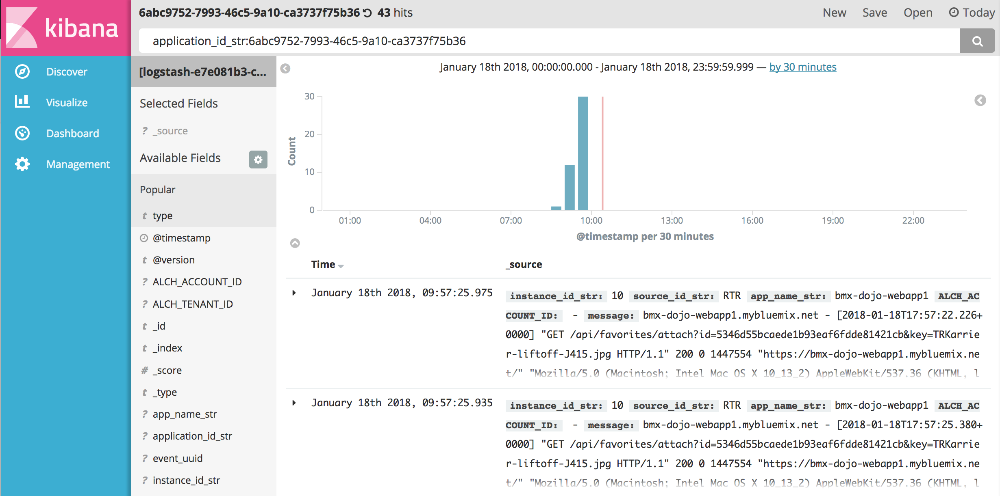

5.  As an example of how to create a filter for Kibana, you will create a filter on the RTR component by adding this to the search bar. The log types you looked at in the **Logs** panel are recorded in logstash with the field **source_id_str**.

    In the search bar, update the line by adding `AND source_id_str:RTR` after the application id. The line will look something like this:

    `application_id_str:6abc9752-7993-46c5-9a10-ca3737f75b36 AND source_id_str:RTR`

    Click on the magnifying glass (on the right side of the search bar) to filter the entries with the updated search criteria. The number of hits in the upper right will change.

    Expand the first log entry by clicking on the triangle next to the timestamp. You can see the entry details in table or json format. Each remaining log record will have a source_id of RTR:

    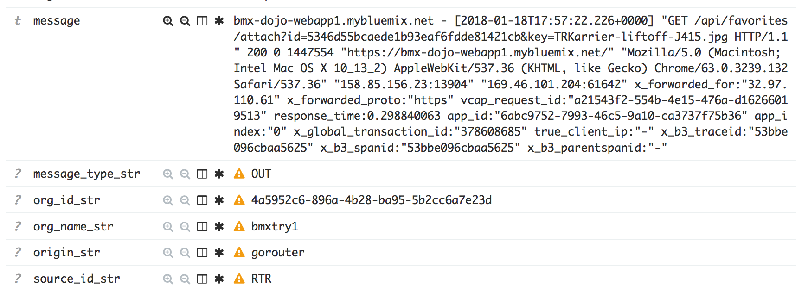

    By default, IBM Cloud stores information from the logging system for 3 days and up to 500 MB per day. If you need access to log data for longer periods, you can use an external log service and set up a drain for the IBM Cloud logs for your application to the service.

    Close the Kibana dashboard tab in the browser when you are finished exploring the logs.

6.  **Optional as time permits** Click on the **Monitoring** in the left-hand navigation to bring up the application availability monitoring dashboard. By default, each application is configured to be monitored with a simple ping-based availability test.

    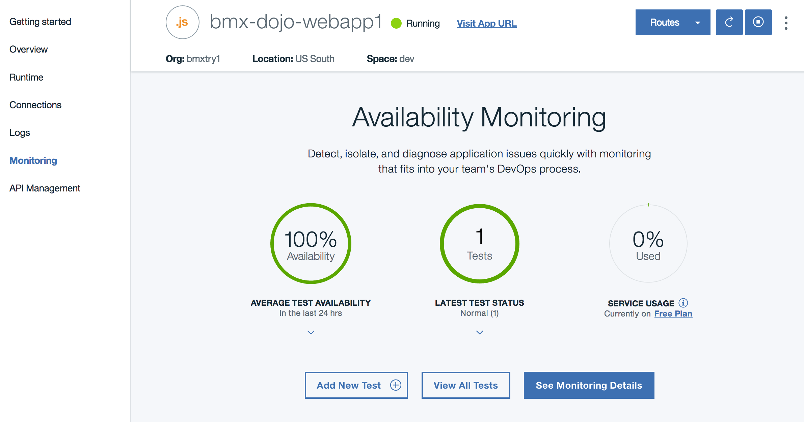

    Since you've just created this application, there isn't a lot to see here (yet). The examples shown in the lab document is for an application that has been live for about 1 day.

    To see more details, click on the **See Monitoring Details** button.

    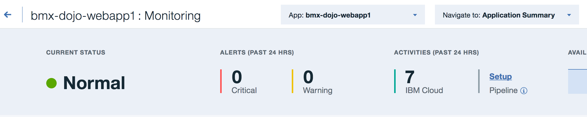

    You can scroll down through this page to view a summary of any test alerts based upon geography and see a chart of response time by geographic region for your application. You can click on an item in the chart to bring up a card with more information on the item.

    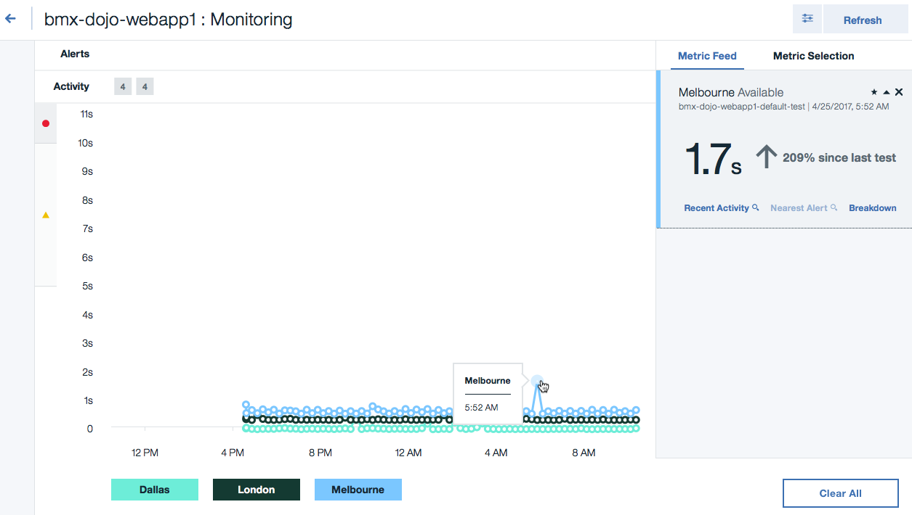

    When finished with reviewing the monitoring details, you can click on the arrow next to the app name in the upper left to return to the application dashboard.

    

7.  When you are ready to delete this application, it is just as easy to remove as it was to add. Follow these steps at any time to remove all traces of the application from your dashboard and IBM Cloud account. From the application dashboard click on the three dots on the right side:

    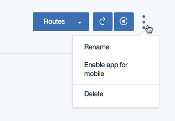

    Select **Delete** from the menu. A prompt will appear to confirm the removal:

    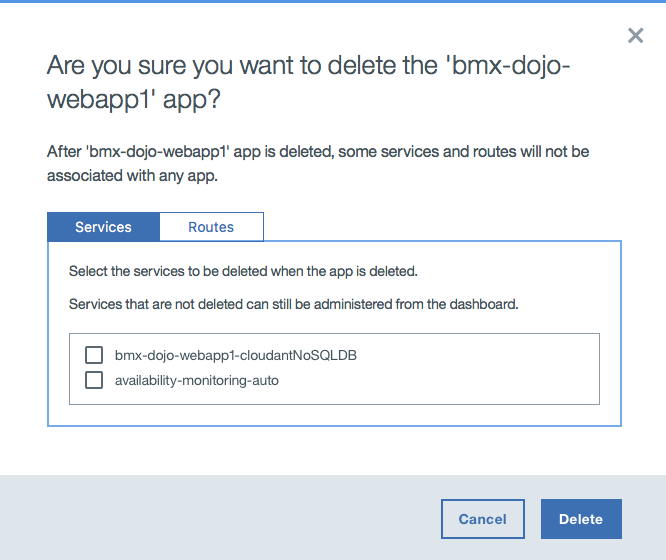

    Select any services shown, and then click on the routes tab and select any routes shown, and then click on the **Delete** button.

**Summary**

In this lab, you have seen how to use the IBM Cloud console to deploy and manage an application. Although the application used in this example was very simple, the capabilities and techniques covered apply to all Cloud Foundry applications on IBM Cloud.

***

© Copyright IBM Corporation 2018

IBM, the IBM logo and ibm.com are trademarks of International Business Machines Corp., registered in many jurisdictions worldwide. Other product and service names might be trademarks of IBM or other companies. A current list of IBM trademarks is available on the Web at &quot;Copyright and trademark information&quot; at www.ibm.com/legal/copytrade.shtml.

This document is current as of the initial date of publication and may be changed by IBM at any time.

The information contained in these materials is provided for informational purposes only, and is provided AS IS without warranty of any kind, express or implied. IBM shall not be responsible for any damages arising out of the use of, or otherwise related to, these materials. Nothing contained in these materials is intended to, nor shall have the effect of, creating any warranties or representations from IBM or its suppliers or licensors, or altering the terms and conditions of the applicable license agreement governing the use of IBM software. References in these materials to IBM products, programs, or services do not imply that they will be available in all countries in which IBM operates. This information is based on current IBM product plans and strategy, which are subject to change by IBM without notice. Product release dates and/or capabilities referenced in these materials may change at any time at IBM&#39;s sole discretion based on market opportunities or other factors, and are not intended to be a commitment to future product or feature availability in any way.
