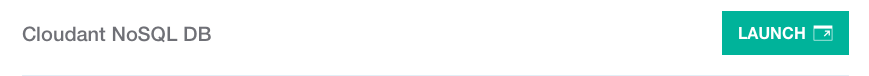
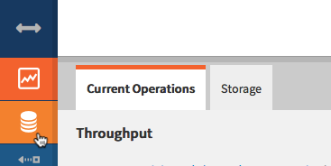

# Using the Cloud Foundry Command-Line Interface

Overview
========

In this lab, you will use the Cloud Foundry command-line interface (CLI) to work with an IBM Cloud Foundry application. The cf CLI is a tool that you will use in a terminal or command window on your workstation.

This lab uses the same sample application that was used in the previous lab “Deploy an app on IBM Cloud.”

Prerequisites
-------------

You need the following accounts and software:

-   An [IBM Cloud account](https://console.bluemix.net/registration)

-   An Internet Explorer, Firefox, or Chrome web browser

The Cloud Foundry (cf) CLI will be installed as part of the lab exercise.

Section 1. Install the Cloud Foundry CLI
==================================

If you already have the Cloud Foundry CLI installed, skip to the next lab section

1.  In a web browser, open the [release download page](https://github.com/cloudfoundry/cli/releases/tag/v6.32.0) . This link goes to version 6.32 which has been tested with the lab steps. Later versions should also be just fine.

2.  Click on the download link specific to your workstation platform to download the package.

3.  Follow the steps appropriate to your workstation operating system.

    > For MacOS and Windows, after downloading the package, run the installer.
    >
    > For Linux, use sudo (or root if necessary) to run the installer (replacing with the file name of your download).
    >
    > Debian/Ubuntu (deb based)
    >
    > ```bash
    > $ sudo dpkg -i ./cf-cli-installer_6.32.0_x86-64.deb && sudo apt-get install -f
    > ```
    >
    > RedHat/CentOS (rpm based)
    > ```bash
    > $ sudo rpm -iv cf-cli-installer_6.32.0_x86-64.rpm
    > ```

After the Cloud Foundry CLI is installed, proceed to the next lab section.

Section 2. Using the Cloud Foundry (cf) CLI
=====================================

In this section, you will work with the application code that you downloaded for the Node.js Cloudant Web boilerplate to create a instance of the running application using only the command line.

1.  Open a command or terminal window and change the working directory to the location where you extracted the downloaded sample application. (The file package.json should be in your current directory.) Note that the cf CLI tool can have issues with cygwin bash shell. It's recommended to use Windows cmd, powershell, or git bash.

2.  Log in to Cloud Foundry by issuing one of the following commands. Use the same region that you used in the web UI when deploying applications:

    `cf login -a https://api.ng.bluemix.net` *(Region: US South)*

    `cf login -a https://api.eu-gb.bluemix.net` *(Region: United Kingdom)*

    `cf login -a https://api.eu-de.bluemix.net` *(Region: Frankfurt)*

    `cf login -a https://api.au-syd.bluemix.net` *(Region: Sydney)*

3.  Enter the email and password that you used to log in to the IBM Cloud web UI. When you log in, you will be prompted to choose the target organization and space if more than one is present for your IBM Cloud account.

4.  Before you deploy the application, you will create a Cloudant database service instance. You can view the available services by running the following command:

    `cf marketplace`

    This command will take a little while to run because it collects all catalog entries:

5.  In the list of services, note the cloudantNoSQLDB service.

    

6.  Create the service by running this command:

    ```
    cf create-service cloudantNoSQLDB Lite myCloudantDB
    ```

    where:

    * `CloudantNoSQLDB` is the name of the service from the `cf marketplace` command.
    * `Lite` is the name of the service plan that you want to use for the service
    * `myCloudantDB` is the name of the service instance that you want to use. You can use any name here or just keep it as myCloudantDB. This name is required to be unique within your IBM Cloud Foundry space.

7.  You can log in (or refresh) your IBM Cloud dashboard and the new service will be shown (you will need to scroll to the bottom of the Apps dashboard or switch to the Services dashboard).

    

8.  Deploy the application.

    Push the application to IBM Cloud Foundry by entering the following command. This will create an application, define a route for the application and upload the artifacts of the application. Change the application name to your unique name:

    ```
    cf push bmx-dojo-webapp1 -c "node app.js" -m 128M --no-manifest --no-start
    ```

    where:

    * `bmx-dojo-webapp1` is the application name and host name, change this another value to ensure it is unique.
    * `-c "node app.js"` specifies the command to start the application.
    *  `-m` specifies the amount of memory to allocate to each application instance. The default is 1 GB.
    * `--no-manifest` instructs to CLI tool to ignore the manifest file in the current directory. This will prevent any services listed in the manifest from being linked to the application.
    * `--no-start` will tell IBM Cloud Foundry not to automatically start the application after upload.

    > You don't want the application to start automatically because it needs a database to run. You must link the Cloudant database instance to the application before you start the application. In Cloud Foundry, the action of linking is described as binding the service instance.

9.  Link the database and application by using the following command. Substitute the application name and service instance names that you used previously:

    ```
    cf bind-service bmx-dojo-webapp1 myCloudantDB
    ```

    where:

    * `bmx-dojo-webapp1` is the application name used for the `cf push`.
    * `myCloudantDB` is the service instance name used when the service was created.

    > If you open the application dashboard in the web UI, you will see that the service is now showing in the connections list for the application.

10. Start the application by running the following command. Substitute the name of your application:

    ```
    cf start bmx-dojo-webapp1
    ```

    where:

    * `bmx-dojo-webapp1` is the application name.

    In the terminal, messages from IBM Cloud will appear showing the staging and deployment process for the application. In the application dashboard in the web UI, you will see some activity messages as the application starts.

11. The web UI may lag after the terminal shows the application has started. If this happens, refresh the application dashboard page. When it shows as running:

    

12. Click on the route to open the application. You have successfully created a running copy of the application using the Cloud Foundry command line interface.

Section 3. Modify the application and republish to IBM Cloud
==========================================================

Now with a way to deploy the application from your development system, you can make changes to the application and then republish it to IBM Cloud. In this section you will see how to do this and also learn a little about the Cloudant dashboard.

1.  In a text editor, open the file `app.js` and modify the name of the file, the file description, and the value (lines 354, 355, and 358):

    * Line 354: Change the docName from 'sample_doc' to 'test_doc'
    * Line 355: Change the docDesc from 'A sample Document' to 'A test Document'
    * Line 358: Change the value from 'A sample Document' to 'A test Document'

    ``` javascript
        // push sample data
        // save doc
        var docName = 'test_doc';
        var docDesc = 'A test Document';
        db.insert({
            name: docName,
            value: 'A test Document'
        }, '', function(err, doc) {
            if (err) {
            console.log(err);
            ...
      ```

    Save the file when you’re finished editing.

    When the application is accessed for the first time, it creates a sample document in the database.

    You just modified the code that creates the sample document in the database. Now, you need delete the document from the database so that when you push this change to IBM Cloud, a new sample document will be created with the changed name and value.

2.  From the application dashboard in the web UI, click on the Cloudant database connection name to bring up the service dashboard.

    

3.  From the service panel click on the **LAUNCH** button to open the Cloudant console.

    

    Click on the database icon to bring up the database view.

    

    Open the `my_sample_db` database by clicking on the name:

    

4.  Select the document and delete it by clicking on the trash icon.

    

5.  Confirm the deletion when prompted.

6.  Redeploy the updated application with the push command. This time, you don’t need to include the `--no-start` or `-m` parameters.

    `cf push bmx-dojo-webapp1 -c "node app.js" --no-manifest`

    > While the `cf push` is running, try to reload the page for the application. What do you notice? Is the application accessible while it is being updated?

8.  After the application is restarted, open it again to ensure that your changes are now active. The document should now have the name `test_doc`.

    

9.  Just as with the web console, you can also access the logs for your application using the CLI. Run this command in the terminal (substituting for your application name):

    `cf logs bmx-dojo-webapp1`

    Now perform some actions on the application (even a page reload is sufficient). This cf command will stream events from the application loggregator to the terminal. Type **control-C** in the terminal to stop the streamed output. Next, run:

    `cf logs bmx-dojo-webapp1 –-recent`

    This will show recent (up to the buffer length) log events and can help to see what "just happened" to the application.

10. There are times when a developer really wants to see what is going on in the actual environment of the application. IBM Cloud Foundry uses the Diego architecture of Cloud Foundry so you can ssh to the container running your application if needed. Try this with your application now:

    `cf ssh bmx-dojo-webapp1`

    The application artifacts are all in the app subdirectory of this shell. From the ssh to the container hosting the application you can use common tools like top or modify file data of the application. However, this filesystem is ephemeral and will be lost if the application is restaged. Typing exit will close the session as usual.

**Summary and Clean up**

In this lab, you learned how to use the Cloud Foundry CLI tool to manage an application including deployment, binding application services, and deleting the application.

1.  Delete the application and service and confirm the deletion by running the following two commands:

    Delete the application: `cf delete bmx-dojo-webapp1 –r`

    * `bmx-dojo-webapp1` is the application name to be deleted.
    * `-r` instructs IBM Cloud to also delete the routes attached to the application.

    Delete the service: `cf delete-service myCloudantDB`

    * `myCloudantDB` is the service instance to be deleted.

    You can confirm that the application and service were deleted by checking the dashboard in the IBM Cloud web UI.

***

© Copyright IBM Corporation 2018

IBM, the IBM logo and ibm.com are trademarks of International Business Machines Corp., registered in many jurisdictions worldwide. Other product and service names might be trademarks of IBM or other companies. A current list of IBM trademarks is available on the Web at &quot;Copyright and trademark information&quot; at www.ibm.com/legal/copytrade.shtml.

This document is current as of the initial date of publication and may be changed by IBM at any time.

The information contained in these materials is provided for informational purposes only, and is provided AS IS without warranty of any kind, express or implied. IBM shall not be responsible for any damages arising out of the use of, or otherwise related to, these materials. Nothing contained in these materials is intended to, nor shall have the effect of, creating any warranties or representations from IBM or its suppliers or licensors, or altering the terms and conditions of the applicable license agreement governing the use of IBM software. References in these materials to IBM products, programs, or services do not imply that they will be available in all countries in which IBM operates. This information is based on current IBM product plans and strategy, which are subject to change by IBM without notice. Product release dates and/or capabilities referenced in these materials may change at any time at IBM&#39;s sole discretion based on market opportunities or other factors, and are not intended to be a commitment to future product or feature availability in any way.
