# Introduction to IBM Cloud Continuous Delivery and toolchains

Overview
========

In this lab, you will see how to deploy and manage the sample application in IBM Cloud using a continuous delivery methodology. You will learn how Continuous Delivery toolchains can be used to manage an application in an automated manner as you edit the application code, test changes and then commit them to a repository.

Prerequisites
-------------

You need the following software:

-   Internet Explorer, Safari, Firefox, or Chrome web browser

Section 1. Create the application using a toolchain
===================================================

In this lab section, you'll get started creating a toolchain automatically from an existing GitHub repository. This repository has a **Deploy to IBM Cloud** button that will automatically create a continuous delivery toolchain, fork a copy of the application to your own code repository, and run the delivery pipeline in the toolchain to deploy the application.

1.  In a web browser open the IBM Cloud console:

    -   https://console.bluemix.net/: This link should take you to your default region.

2.  Click **Log In** and then enter your login information on the IBM id page and click **Sign in**. You will see your dashboard view.

    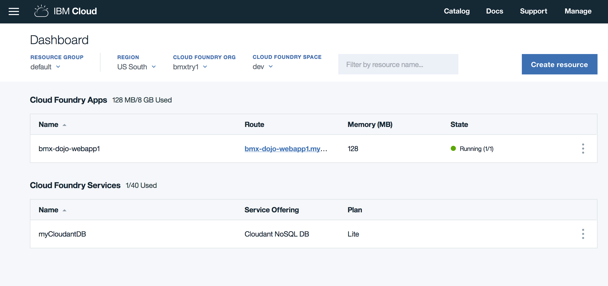

3.  In another browser tab, open the sample application GitHub repository at <http://github.com/IBM-Bluemix/nodejs-cloudant> .

    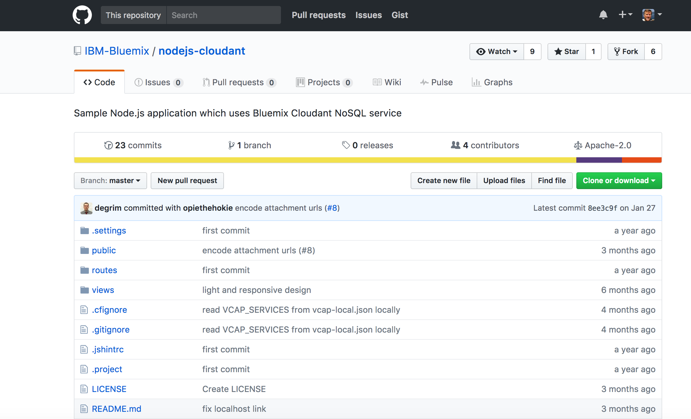

4.  Scroll down on the page and click on the **Deploy to IBM Cloud** button.

    

5.  The toolchain creation page for your new application will be shown with the Delivery Pipeline options. These options include region, organization, space, and an app name based on the repository name.

    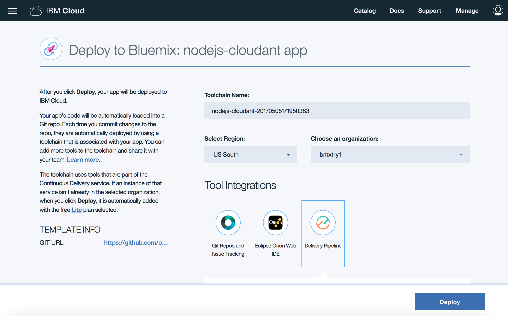

    Select the US South region from the pulldown. Then, click on the **Git Repos and Issue Tracking** icon. When using the **Deploy to IBM Cloud** button a source code repository hosted by IBM on GitLab Community Edition is used. The panel shows the action to take (fork, clone, existing) for creating the repository for the toolchain and the source repository.

    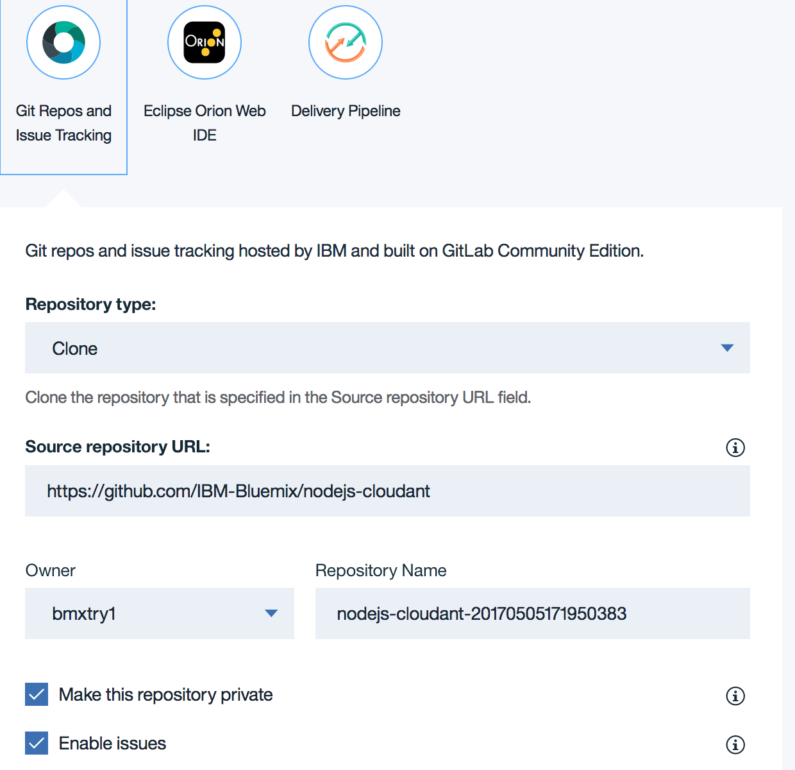

5.  Click on the **Delivery Pipeline** icon and change the application name to match the name you were using for the previous deployments, or any new name with your initials and the date to make it unique. Then click on the **Deploy** button.

6.  A confirmation display will appear.

    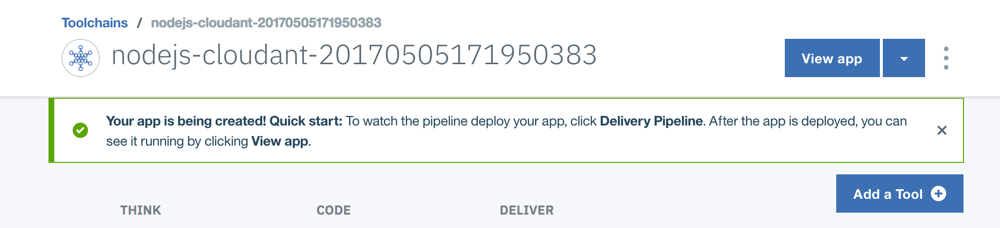

7.  Click on the icon for **Delivery Pipeline**. Depending on how quickly you do this, you might be able to see the Deploy stage still running. If it is, open the **View logs and history** link to follow along with the deployment (use the browser back button to get back to the stage view).

    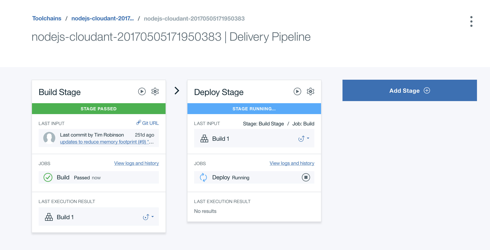

    > If the deployment has completed, both stages will have green bars at the top.

    If you see in the **Deploy Stage** under the JOBS list that the **Deploy** job has a status of "Passed", the application has successfully deployed. Click on the link below the application name to open the application.

    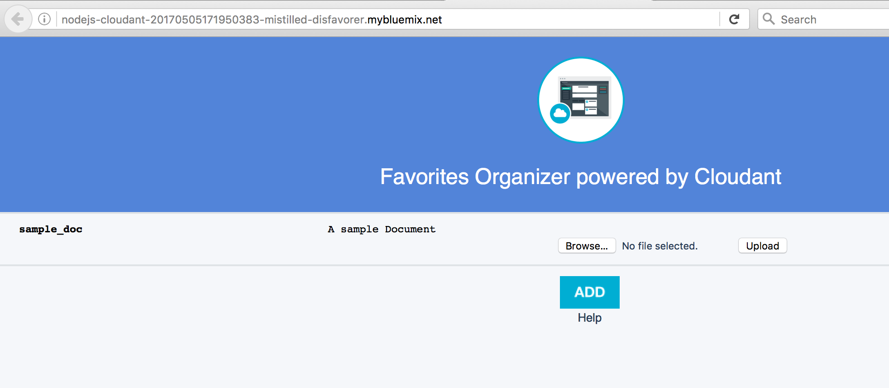

Summary
-------

You've now added the sample application using the Continuous Delivery toolchain feature of IBM Cloud. Now let's put the toolchain to work.

Section 2. Working with the Delivery Pipeline
=============================================

You saw in the second lab with the Cloud Foundry CLI how when an application is pushed to Cloud Foundry, it is temporarily unavailable. In this lab, you will see how to fix this by modifying the default deployment script in Delivery Pipeline.

1.  From the IBM Cloud App dashboard, click on the hamburger (three lines) menu, and select **Services** and then **DevOps** from the drop-down items. Select your toolchain to get the toolchain **Overview**, and then click on the icon for **Delivery Pipeline**.

    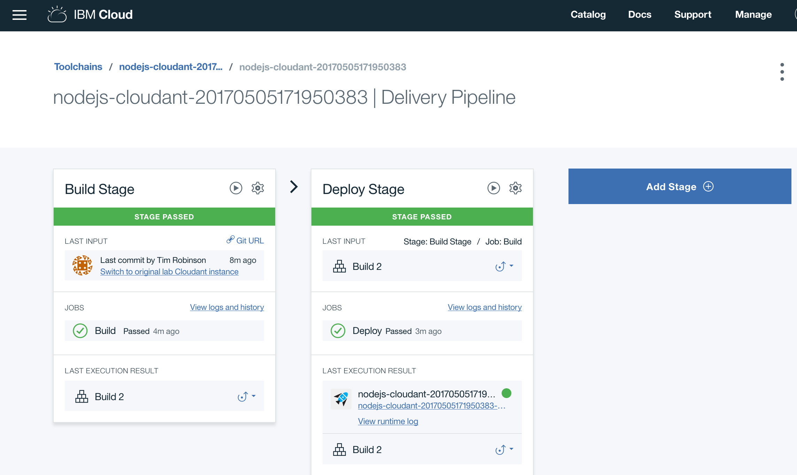

    This simple pipeline has two stages, a Build stage that runs a build job based on commits to a source code repository, and a Deploy stage that has a deploy job which takes the build artifacts and deploys them as a Cloud Foundry application.

    > There's one more type of job (besides build and deploy) that can be configured in a stage and that is a test job. You won't need one of those today, but test jobs can be used, as you might expect, to run code tests, or test an application deployed to a staging environment before continuing to run later stages that would deploy to production.

2.  To modify the deploy job script in the Deploy stage, click on the settings icon in the upper right corner of the stage and select **Configure Stage**.

    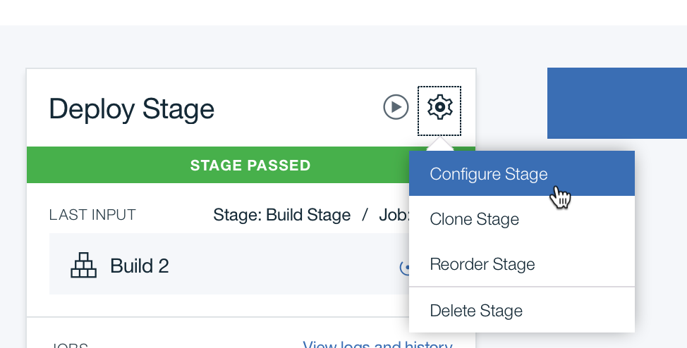

3.  This defaults to the **Jobs** panel. This stage has a single job called deploy and the details of the job are shown.

    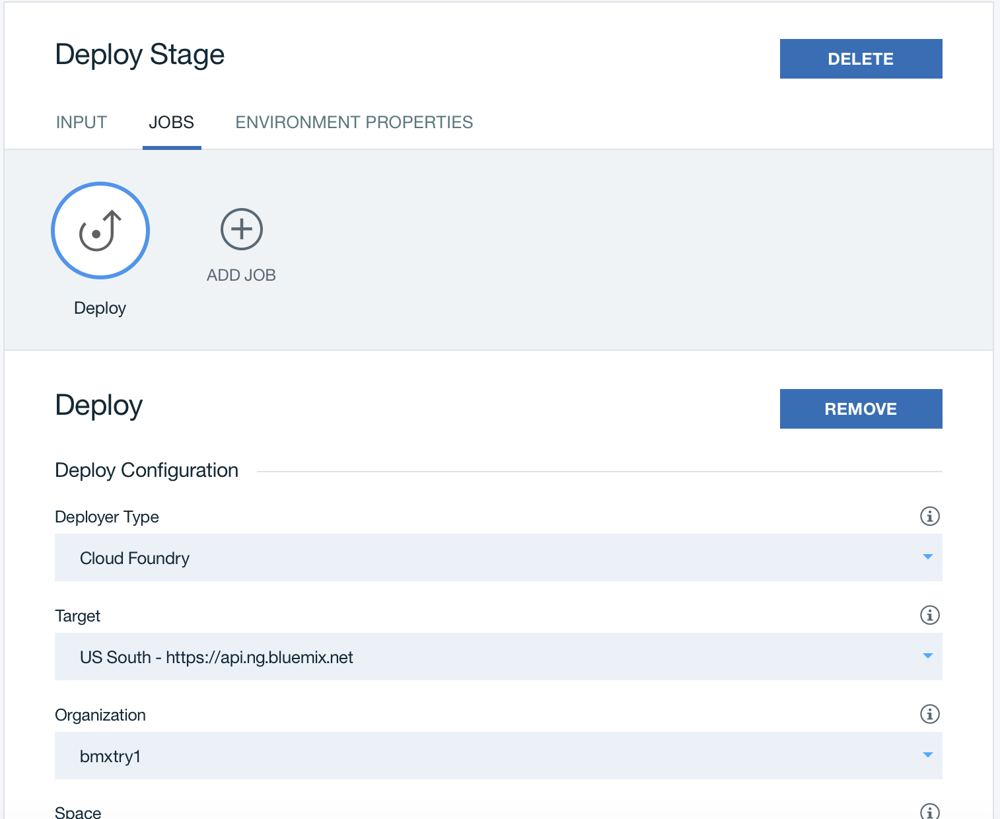

4.  You will keep the Cloud Foundry deployer type, and just replace the default deployment script. [Download the blue-green.sh script](static/blue-green.sh) and then paste it into the Deploy script box.

    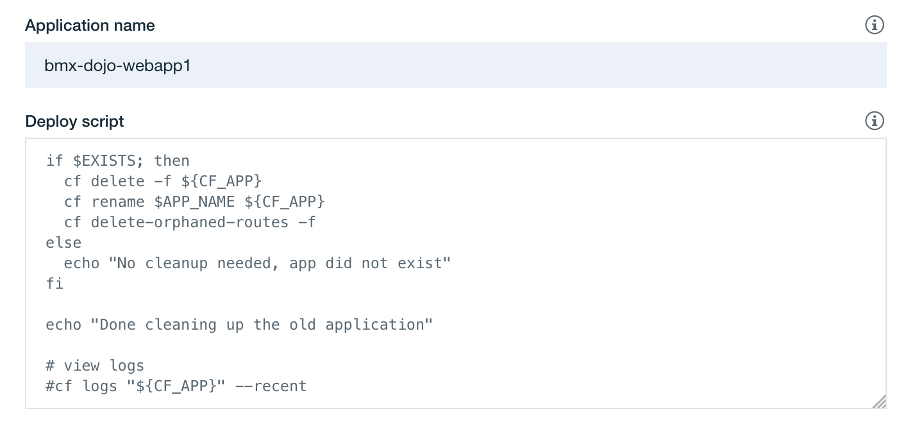

5.  For this script to function, some environment variables need to be added. The `CF_APP` environment variable in the script is already defined, but you'll need to add a value for `SERVICES` and `ROUTES`. Scroll up and click on **ENVIRONMENT PROPERTIES** to bring up the editor to set properties within the stage. Then click on **ADD PROPERTY** and choose Text property.

    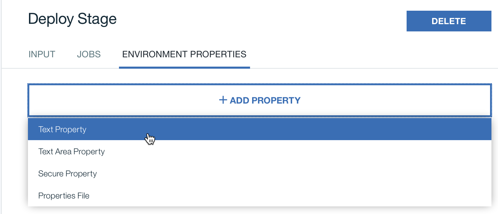

6.  Assign a value to `SERVICES` using the same service name from the manifest.yml file `sample-nodejs-cloudant-cloudantNoSQLDB`

8.  Add another text property and this time, assign a value to `ROUTES` using the hostname that you have used previously for the application in the web UI and append the default system domain using `:mybluemix.net`. After adding both, you should see:

    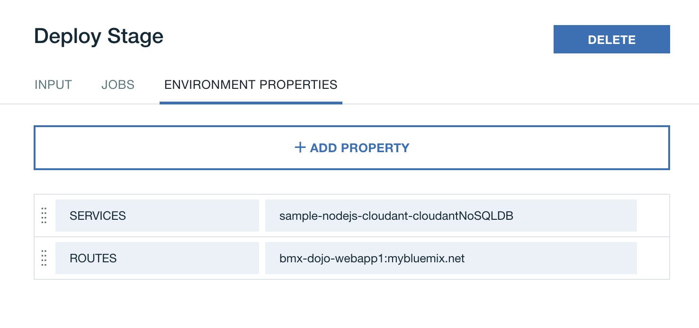

9.  Click on the **SAVE** button to save the changes to the Deploy stage.

8.  You can use a manual trigger to execute the deploy instead of needing another commit to the code repository and re-running the entire pipeline. Click on the **Run Stage** button to trigger the manual execution of the Deploy stage. When you trigger a manual run of a stage, it will start running with the latest artifacts from the input to the stage.

    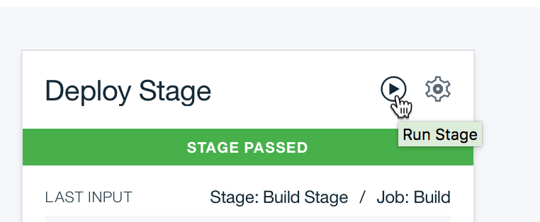

9.  Click on the **View logs and history** link in the stage to be able to follow along with the deployment process of the new application instance and the removal of the previous one.

    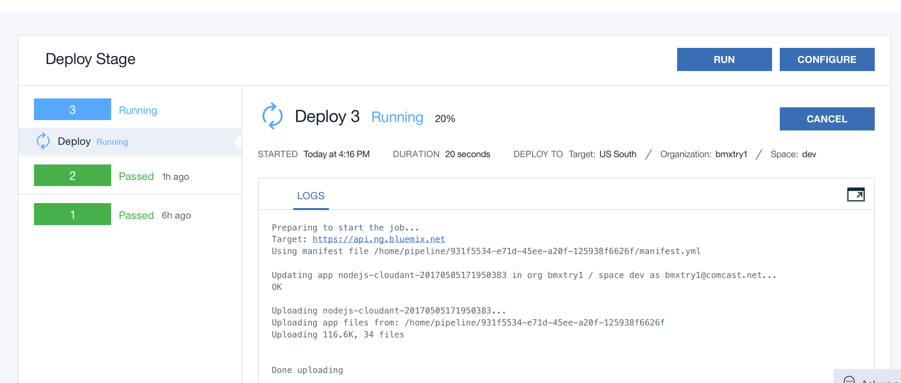

10. After the first blue-green deployment, the link shown in the Deploy stage may still be the app name with the random strings appended. To check that the hostname you specified in the `ROUTES` environment variable is active, go to the application overview from the IBM Cloud Dashboard and check the **Routes** pulldown:

    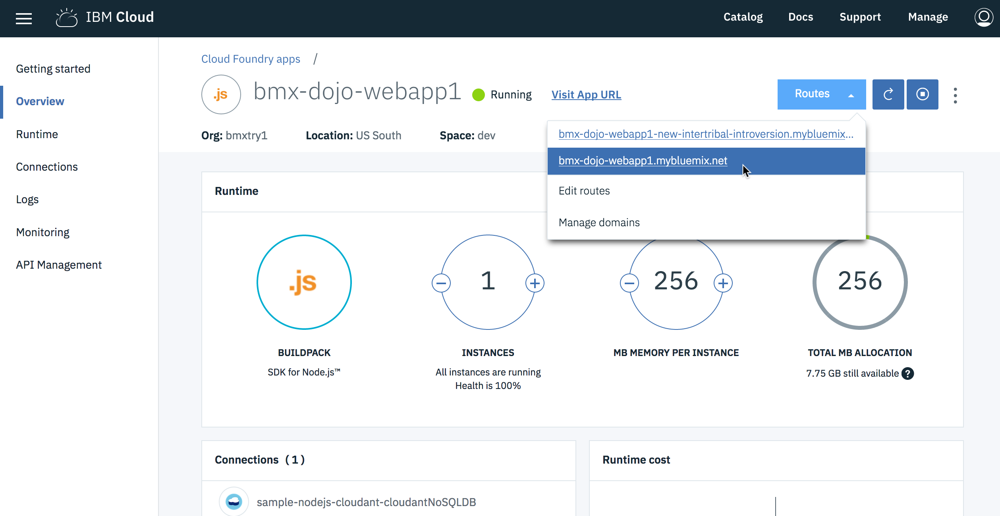

11. Click on the short route name to open the application in a new tab.

    

Section 3. Update the application using a web browser
=====================================================

With the deployment script updated, you can now modify the application, commit the change and the application will be updated with zero downtime. You'll use Orion web editor for this, but this method works with any technique that updates the git SCM used by the delivery pipeline.

1.  Go back to your browser tab with the toolchain and click on the name of the toolchain to return to the panel for your toolchain

    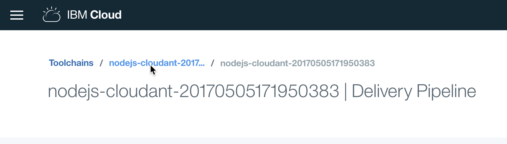

    The **Overview** panel for the toolchain will be shown with the current tools displayed.

    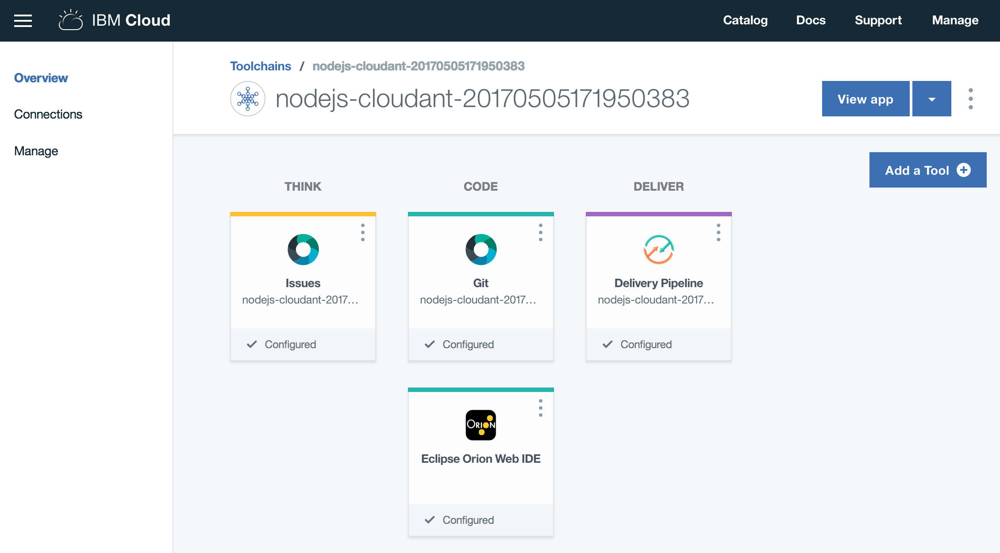

2.  Click on the **Eclipse Orion Web IDE** icon to launch a web editor and code management environment hosted from IBM Cloud, and running in the browser.

    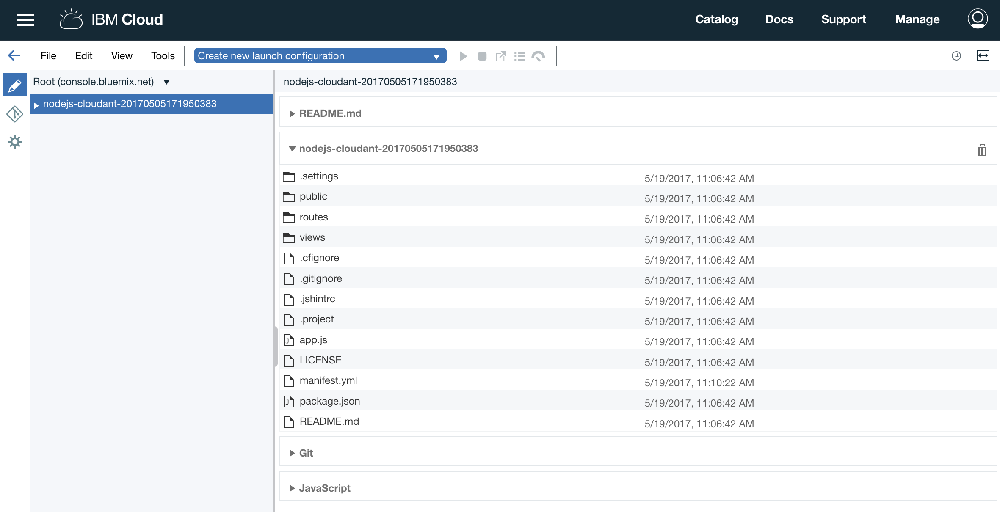

    Make note of the pencil icon in the upper left next to the repository name. This is the edit mode for the IDE.

3. Open the views/index.html file and update the banner on line 15. It's time you owned this application! Change it to (or use your name if you prefer):

    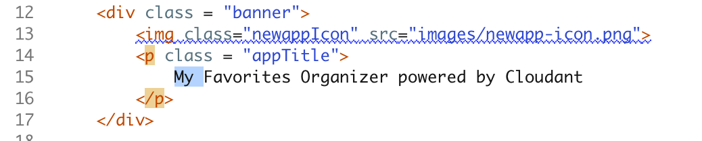

    > if you hover over the line above, an accessibility warning tooltip appears indicating that the &lt;img&gt; tag is missing an alt attribute, which is needed for screen readers that won't display the image. You can add this attribute to fix this if you prefer.

    After you move the cursor off the line with the banner, the file change in the workspace is saved.

4. Click on the **Git** icon on the left side of the IDE below the **Edit** icon. This will open the IDE's interface to a git-based source code repository. If you are familiar with git concepts, you will recognize key parts of the display.

    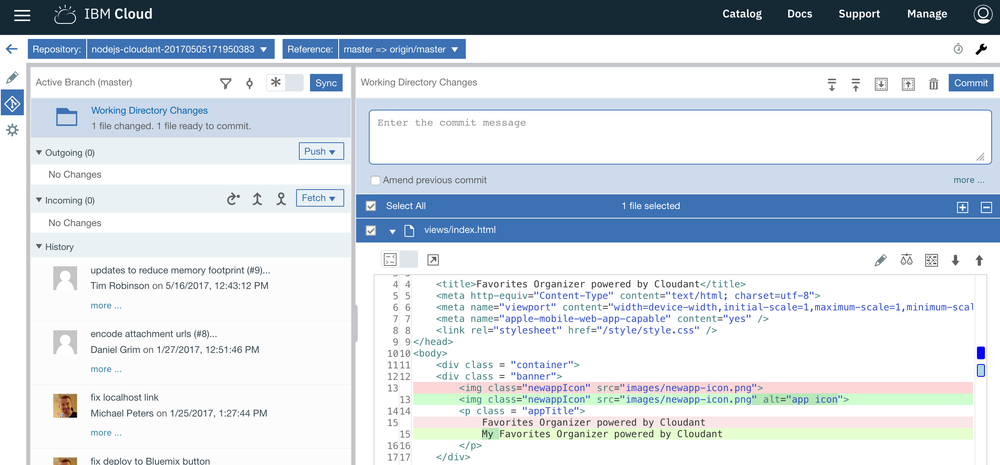

    In the right panel, there is a list of the changed files compared to the origin repository.

5.  Add a comment in the **Commit message** panel and then click on the **Commit** button.

6.  Next click on the **Push** button to synchronize these changes to the origin repository.

    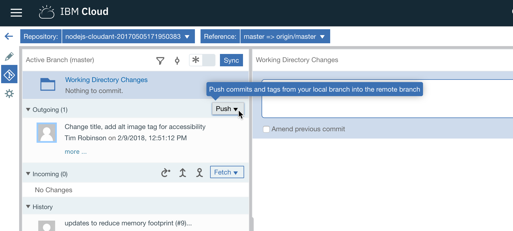

7.  If you move quickly by clicking on the left arrow to go back to the toolchain **Overview** and then click on the **Delivery Pipeline** you may be able to catch the pipeline in action.

    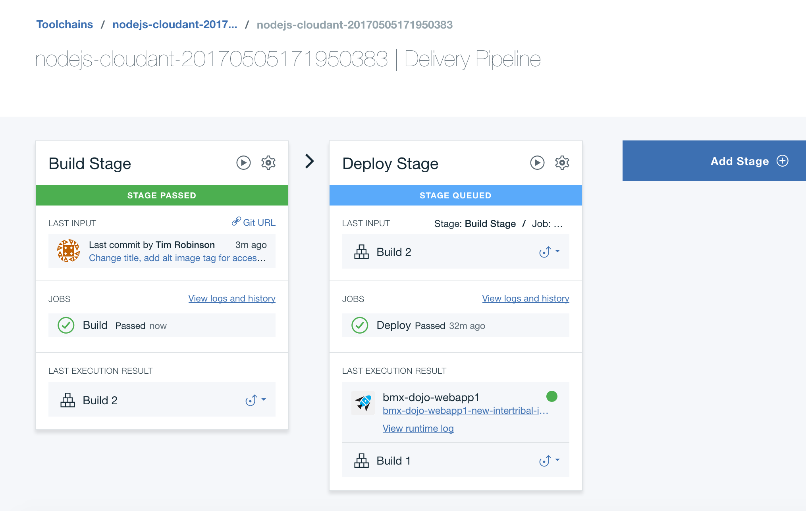

    You will see in the Build stage that there has been an input update, based upon your push to the git repository. The Build stage ran a simple builder, and then the Deploy stage will deploy the modified application using the blue-green deployment script.

8.  Go to the browser tab you have opened to the application. Reload the application home page while the delivery pipeline is running the deployment. You'll now notice that the application is continuously responding. When the updated application is live, the heading will show your changes:

    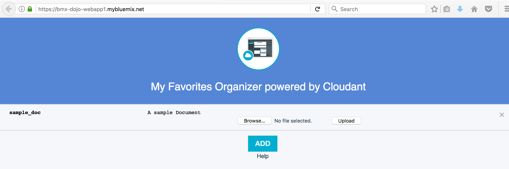

Summary
-------

IBM Cloud Continuous Delivery toolchains can work with your source code repositories to provide an integrated DevOps experience including automated deployments of changes made using either a web editor or your local workstation tools with a git push to the source code repository.

**Summary**

You have seen how to use several aspects of Continuous Delivery toolchains, including source code management, editing with the Orion Web IDE, and customization of the Delivery Pipeline to change how the sample application is deployed to avoid downtime.

***

© Copyright IBM Corporation 2018

IBM, the IBM logo and ibm.com are trademarks of International Business Machines Corp., registered in many jurisdictions worldwide. Other product and service names might be trademarks of IBM or other companies. A current list of IBM trademarks is available on the Web at &quot;Copyright and trademark information&quot; at www.ibm.com/legal/copytrade.shtml.

This document is current as of the initial date of publication and may be changed by IBM at any time.

The information contained in these materials is provided for informational purposes only, and is provided AS IS without warranty of any kind, express or implied. IBM shall not be responsible for any damages arising out of the use of, or otherwise related to, these materials. Nothing contained in these materials is intended to, nor shall have the effect of, creating any warranties or representations from IBM or its suppliers or licensors, or altering the terms and conditions of the applicable license agreement governing the use of IBM software. References in these materials to IBM products, programs, or services do not imply that they will be available in all countries in which IBM operates. This information is based on current IBM product plans and strategy, which are subject to change by IBM without notice. Product release dates and/or capabilities referenced in these materials may change at any time at IBM&#39;s sole discretion based on market opportunities or other factors, and are not intended to be a commitment to future product or feature availability in any way.
